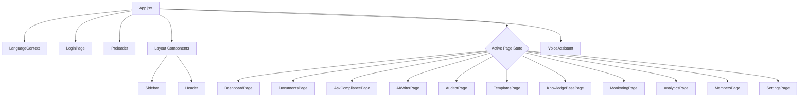

# OIC Compliance Portal

Welcome to the **OIC (Organization of Islamic Cooperation) Compliance Portal**, a state-of-the-art web application designed to streamline compliance auditing, document management, policy formulation, and real-time monitoring.

Built using **React 18**, **Vite**, and **Tailwind CSS**, the portal features bilingual support (English LTR and Arabic RTL) and integrates advanced tools such as an **AI Compliance Assistant**, an **AI Writer**, and an interactive **Voice Assistant** for hands-free operations.

---

## 🏗️ Architecture & Component Flow

The application manages local state at the root level (`App.jsx`) and injects language context globally. Below is the system flow and page routing schema:



---

## ✨ Core Features

1. **📊 Interactive Dashboard**
   - Central hub displaying real-time metrics, status breakdowns, and a list of active alerts.
   - Comprehensive activity logging keeping track of edits, audits, and compliance updates.

2. **📁 Documents Manager**
   - Categorization by **OIC Rules & Regulations** and **General Policies** (Policies, Contracts, Compliance, HR, Finance, Safety).
   - Document status workflows (Draft, Reviewed, Final) with quick filtering, searching, and metadata details.

3. **💬 Ask Compliance (AI Assistant)**
   - Interactive chat interface enabling compliance officers to query regulations, guidelines, and get instant guidance.

4. **✍️ AI Writer**
   - Draft and refine policy documents, reports, and communications with built-in AI prompts.

5. **🔍 Compliance Auditor**
   - Structured checksheets and audit logs to verify organizational processes against standard regulations.

6. **📑 Templates Directory**
   - Ready-to-use layouts for standard audits, compliance reviews, and legal agreements.

7. **📚 Knowledge Base**
   - Life-cycle management for articles, starting as *Pending*, moving to *Active*, and finally *Archived*.

8. **🚨 Real-Time Monitoring**
   - Live monitoring of external or internal feeds to identify compliance risks or policy breaches immediately.

9. **🗣️ Voice Assistant**
   - Fully interactive voice integration allowing users to navigate pages and query information using standard audio commands.

10. **🌐 Bilingual Support (EN/AR)**
    - Dynamic direction swapping (LTR/RTL) between English and Arabic with localized layouts, navigation titles, and tables.

---

## 🛠️ Technology Stack

- **Framework**: [React 18](https://react.dev/) (Vite-powered development and bundling)
- **Styling**: [Tailwind CSS 3](https://tailwindcss.com/) & [PostCSS](https://postcss.org/) for highly responsive layouts
- **Icons & UI Details**: Custom components built with vanilla CSS transitions and icons.
- **State Management**: React Hooks (`useState`, `useEffect`, and Context API) for global configuration.

---

## 🚀 Getting Started

### Prerequisites

Make sure you have Node.js (version 18 or above recommended) and npm installed.

### Installation

1. Clone or copy the repository files.
2. Navigate to the project directory:
   ```bash
   cd ui5
   ```
3. Install dependencies:
   ```bash
   npm install
   ```

### Running Locally

To start the Vite local development server:
```bash
npm run dev
```
Open [http://localhost:5173](http://localhost:5173) in your browser to view the application.

### Production Build

To compile the application into static production assets (`/dist`):
```bash
npm run build
```

To preview the production build locally:
```bash
npm run preview
```

---

## 📂 Project Structure

```text
├── dist/                   # Production build outputs
├── public/                 # Static assets (images, videos, icons)
├── src/
│   ├── components/
│   │   ├── common/         # VoiceAssistant, StatusBadge, Preloader
│   │   └── layout/         # Header, Sidebar
│   ├── context/
│   │   └── LanguageContext.jsx  # Bilingual translations (EN/AR) & directions
│   ├── data/
│   │   └── mockData.js     # Mock database for documents, users, logs
│   ├── pages/              # Individual module page views
│   ├── App.jsx             # Main routing and global state controller
│   ├── index.css           # Global styles and Tailwind configuration imports
│   └── main.jsx            # React root mount entrypoint
├── index.html              # HTML shell template
├── package.json            # Scripts, dependencies, and configuration
├── postcss.config.js       # PostCSS plugins config
├── tailwind.config.js      # Tailwind utility configuration
└── vite.config.js          # Vite plugin configuration
```

---

> [!NOTE]
> All session authentication is simulated and stored in the browser's `localStorage` under `oic_session` (valid for 24 hours).
